# Inhaal-PE: Foutopsporing

## Inleiding

Bij de start van elke semester moeten alle studenten de nodige handboeken en cursussen aankopen voor de opleiding die ze volgen.
Het huidige systeem van de PXL Book Shop is echter verouderd en men heeft gevraagd om een nieuw POC (Proof Of Concept) te ontwikkelen in de vorm van een console-applicatie om het bestelprocess te vereenvoudigen.

Er werd reeds een eerste versie van de applicatie ontwikkeld maar helaas bevatte deze versie enkele fouten. Het is nu aan jouw om van deze bestaande versie een correct werkende applicatie te maken!

## Vereisten

Om een correct beeld te schetsen geven we nog even een kort overzicht van de originele vereisten waarvoor deze applicatie ontwikkeld werd:

- De gebruiker dient zijn studentnummer en e-mailadres op te geven bij het starten van de applicatie
    - Het studentnummer bestaat altijd uit 8 cijfers
	- Het e-mailadres moet eindigen op `@student.pxl.be`
- Cursussen en handboeken kunnen worden opgevraagd per opleiding. Om de weergave zo overzichtelijk mogelijk te maken zal de gebruiker eerst zijn departement moeten selecteren. Daarna worden enkel de opleidingen van het geselecteerde departement getoond. Op basis van de geselecteerde opleiding wordt dan het overzicht van de beschikbare cursussen en handboeken getoond.
- Om een bestelling definitief te maken moet deze eerst betaald worden, de gebruiker moet dus een duidelijk overzicht krijgen van het te betalen bedrag.

## Opdracht

- Maak een lokale clone van deze repository.
- Los de bugs op en zorg dat het programma correct werkt
- Kopieer en plak de URL van je git repo in de inzending van de opdracht in blackboard.
- Maak een commit voor elke bugfix met de BUG-ID in de commit-message.
- Push je werk naar de repository vóór de deadline.

## Bug Report

### BUG01
- **Fout**: De applicatie kan niet worden gestart
- **Doel**: Los alle syntax fouten op

### BUG02
- **Fout**: Gebruikersgegevens wordt niet gevalideerd
- **Doel**: Zorg ervoor dat een studentnummer exact 8 cijfers bevat en een e-mailadres altijd eindigt op `@student.pxl.be`. Vraag de input telkens opnieuw zolang de validatie mislukt.
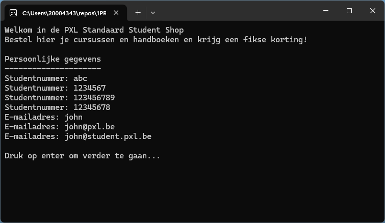

### BUG03
- **Fout**: De departementen worden niet en/of foutief getoond
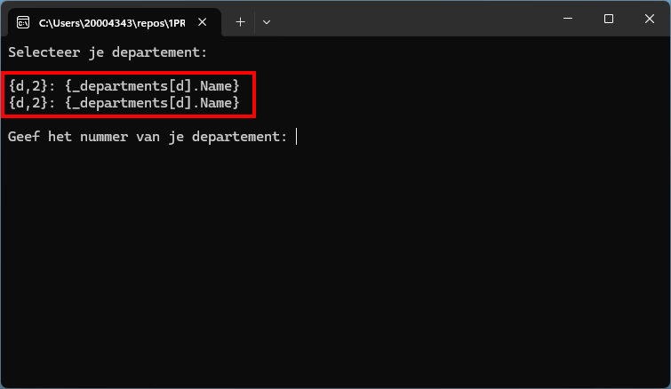
- **Doel**: Toon alle departementen voorafgegaan door een volgnummer dat begint met 1. 
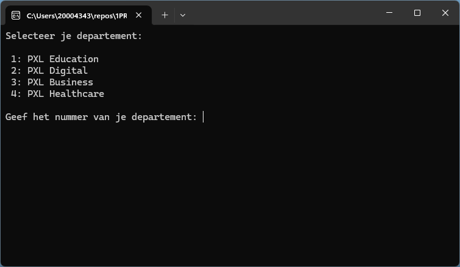
TIP: De variabele `_departments` bevat een lijst met alle departementen

### BUG04
- **Fout**: Bij een foutieve selectie van het departement crasht de applicatie
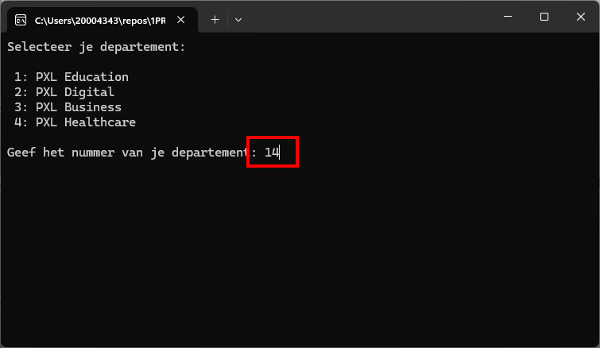
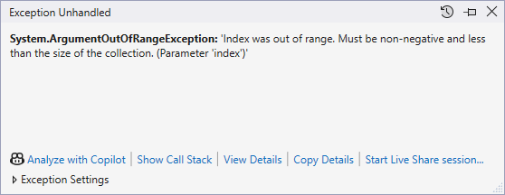
- **Doel**: Zorg ervoor dat de applicatie enkele geldige volgnummers accepteert.
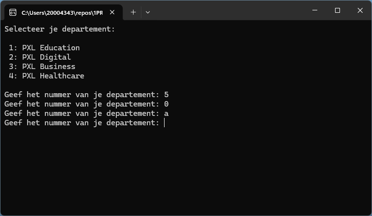

### BUG05
- **Fout**: De getoonde opleidingen zijn niet de opleidingen van het gekozen departement
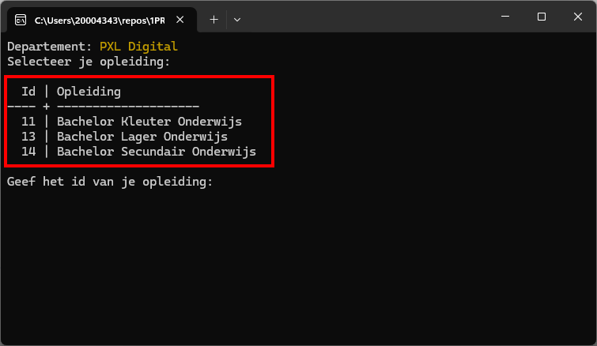
- **Doel**: Toon de opleidingen (`Courses`) van het geselecteerde departement 
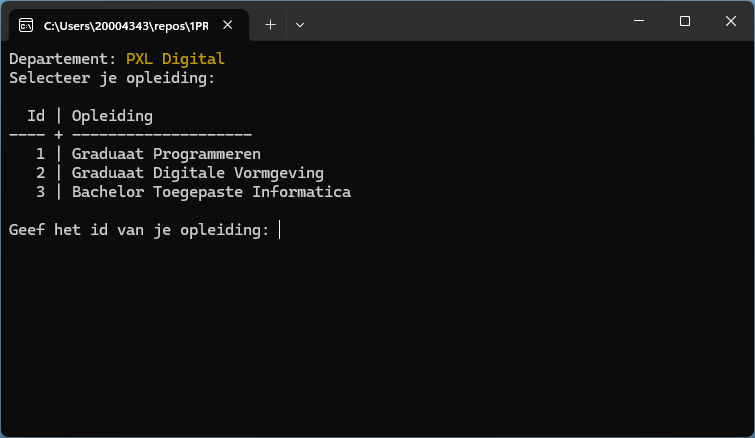

### BUG06
- **Fout**: Bij de ingave van een ongeldig id crasht de applicatie
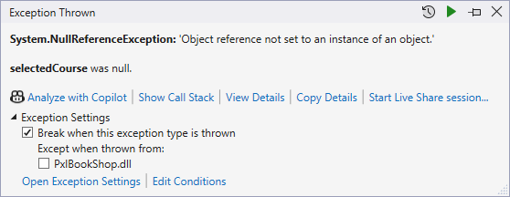
- **Doel**: Zorg ervoor dat de applicatie enkele geldige id's accepteert.
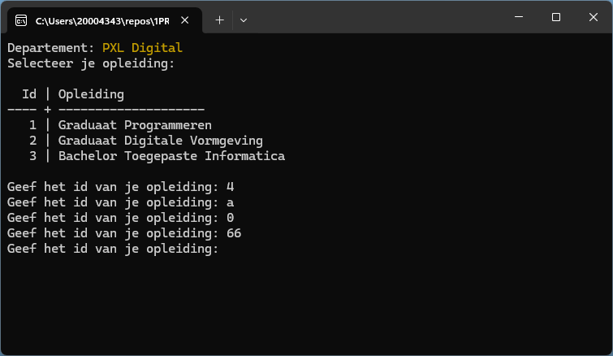

### BUG07
- **Fout**: De lijst van handboeken wordt foutief weergegeven
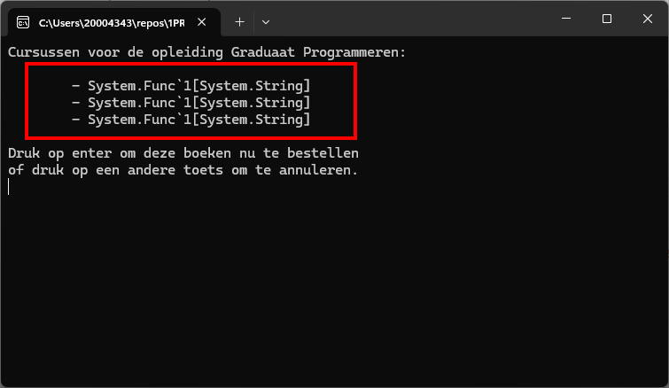
- **Doel**: Zorg ervoor dat voor elk boek de titel en autheur wordt weergegeven
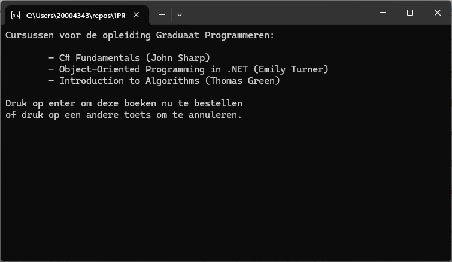

### BUG08
- **Fout**: Bij het bevestigen van een bestelling crasht de applicatie
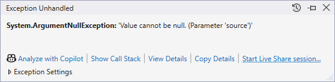
- **Doel**: Voorkom eventuele fouten indien mogelijk of zorg ervoor dat deze correct worden afgehandeld

### BUG09
- **Fout**: Bij het bevestigen van een bestelling wordt het bedrag niet correct weergegeven
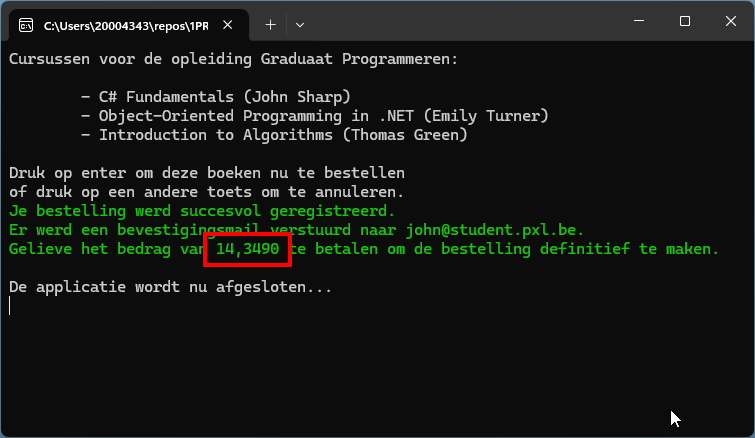
- **Doel**: Toon het bedrag steeds in de lokale munteenheid met 2 cijfers na de komma

### BUG10
- **Fout**: Het weergegeven bedrag wordt niet correct berekend
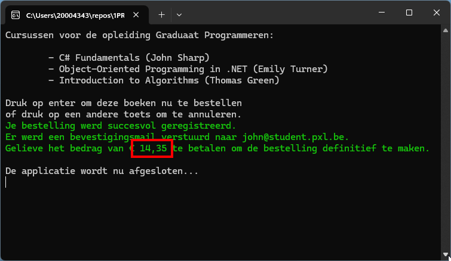
- **Doel**: Bereken het te betalen bedrag door het totaal te bepalen en dit te verminderen met 10%
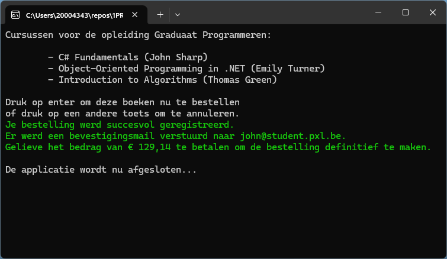

